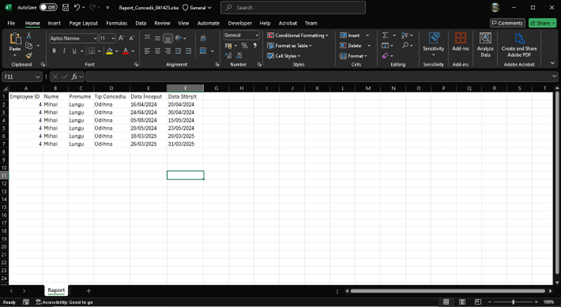
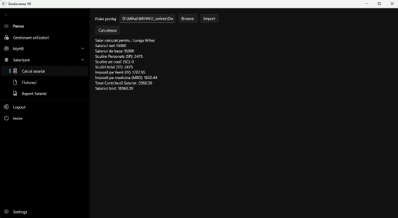
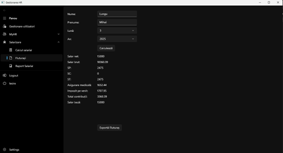
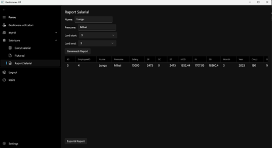
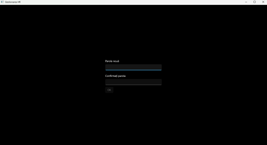
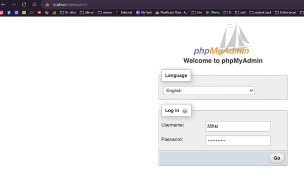
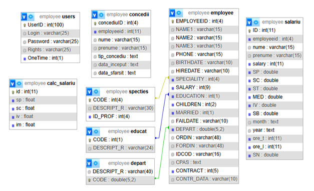

Employee Management System
==========================

Overview
--------

The Employee Management System is a software application developed as part of Mihai Lungu's bachelor's thesis at the Faculty of Physics, Mathematics, and Information Technologies, "Ion Creangă" State Pedagogical University, Chișinău. This application is designed to streamline human resources (HR) and payroll management processes for small and medium-sized enterprises. Built using C#, WinUI 3, Visual Studio 2022, and MySQL, it provides an intuitive and secure interface for managing employee data, leave records, payroll calculations, and user administration. 

## Features

The application is divided into three main modules:

1. **Human Resources Management (MyHR)**:
   
   * **Employee Management**: Add, view, and update employee information, including personal details, contracts, and department assignments.
     
     
   
   * **Leave Management**: Track employee leaves (e.g., vacation, medical, unpaid) and generate reports exportable to Excel. 
   
   

2. **Payroll Management**:
   
   * **Salary Calculation**: Import timesheet data from Excel files, calculate salaries based on Moldova's April 2025 tax regulations, and store results in the database. 
   
   
   * **Payslip Generation**: Generate and export payslips for employees, providing detailed salary breakdowns. 
   
   
   * **Payroll Reports**: Create and export detailed payroll reports for selected employees and time periods. 
   

3. **User Management**:
   
   * Available only to administrators, this module allows creating, viewing, and deleting user accounts with role-based access (Administrator, Director, HR, Accountant). 
   
   
   * Implements secure password policies, including one-time passwords for new users and complexity requirements (minimum 8 characters, including uppercase, lowercase, and digits). 
   
   

Technologies Used
-----------------

* **C#**: Primary programming language, leveraging object-oriented programming principles.

* **WinUI 3**: Framework for building the user interface, ensuring a modern and responsive design.

* **Visual Studio 2022**: Integrated Development Environment (IDE) for coding, debugging, and deployment.

* **MySQL 10.4.28**: Database management system for storing employee, leave, payroll, and user data.

* **MySQL Connector**: Facilitates connectivity between the application and the MySQL database.

* **XAMPP**: Provides phpMyAdmin for database management. 

* **Microsoft Office Excel Interop**: Enables export of reports and payslips to Excel format.
  
  

Database Structure
------------------

The application uses a MySQL database named "employee" with the following tables:

* **Concedii**: Stores leave records.

* **Depart**: Lists company departments.

* **Educat**: Records employee education levels.

* **Employee**: Stores employee details (e.g., name, IDNP, CPAS, salary).

* **Salariu**: Contains payroll data.

* **Specties**: Lists employee specializations.

* **Users**: Manages user credentials and access rights.

* **Cale_salariu**: Stores tax and exemption rates. 

Installation
------------

1. **Prerequisites**:
   
   * Install MySQL 10.4.28 and XAMPP (includes Apache, MySQL, PHP, and phpMyAdmin).
   
   * Install Visual Studio 2022 with .NET and WinUI 3 support.
   
   * Ensure Microsoft Office Excel is installed for report exports.

2. **Database Setup**:
   
   * Launch XAMPP and start the MySQL and Apache modules.
   
   * Access phpMyAdmin via a web browser and create a database named "employee".
   
   * Import the provided SQL schema to create the necessary tables and relationships.

3. **Application Setup**:
   
   * Clone the repository or extract the project files.
   
   * Open the project in Visual Studio 2022.
   
   * Update the database connection string in the application code to match your MySQL server credentials.
   
   * Build and run the application.

4. **Running the Application**:
   
   * Launch the application and log in using the default administrator credentials. 
   
   * Navigate to the main menu to access HR, payroll, or user management modules based on your user role. 

Usage
-----

1. **Login**:
   
   * Enter your credentials in the login window. New users will be prompted to change their one-time password upon first login. 

2. **HR Management**:
   
   * Add new employees by filling out the employee form and clicking "Create". 
   
   * View or edit employee details, with certain fields (e.g., ID, IDNP, CPAS) set to read-only to prevent unauthorized changes.
   
   * Manage leaves by selecting an employee and adding leave details. Export leave reports to Excel.

3. **Payroll Management**:
   
   * Import timesheet data from an Excel file using the "Browse" and "Import" buttons. 
   
   * Calculate salaries using the "Calculate" button, which applies tax rates and stores results in the database.
   
   * Generate and export payslips or payroll reports for specific employees and periods.

4. **User Management**:
   
   * Administrators can add new users by filling out the user form and assigning roles. 
   
   * Delete users or update their details as needed.

5. **Settings**:
   
   * Modify tax and exemption rates to comply with current legislation. 

Security
--------

* **Role-Based Access**: Access to modules is restricted based on user roles (Administrator, Director, HR, Accountant).

* **Password Policies**: New users receive a one-time password, and subsequent passwords must meet complexity requirements.

* **Data Protection**: Employee data is securely stored in the MySQL database with strict access controls.

Future Improvements
-------------------

* **Enhanced Payroll Calculation**: Support for calculating salaries based on specific work performed, not just timesheets.

* **Advanced Reporting**: Generate reports based on additional criteria, such as leave types.

* **Bulk Timesheet Import**: Allow simultaneous import of multiple timesheet files to reduce manual processing.

* **Dedicated Server**: Implement a centralized database server for multi-user access over a LAN.

License
-------

This project is licensed under the MIT License. Note that the MySQL database used in this application is subject to the GNU General Public License (GPL), with commercial licenses available from Oracle for proprietary use.
